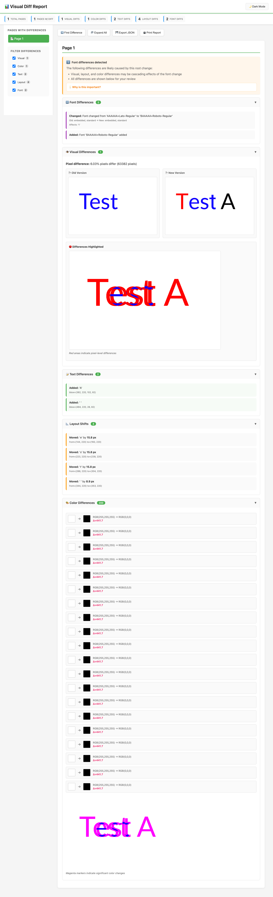

# Visual-Diff

`visual-diff` is a JVM/Scala-based command-line tool that compares two PDF files **or image files** and generates a comprehensive report on their differences.

## Features

-   **Image Format Support**: Compare image files directly! Supports JPG/JPEG, PNG, GIF, BMP, and TIF/TIFF formats.
-   **Visual Diff**: Renders PDFs to images and performs a pixel-by-pixel comparison, highlighting any visual changes.
-   **Color Diff**: Detects color changes in text and graphics using RGB color distance analysis, with configurable sensitivity.
-   **Text Diff**: Extracts all text content with coordinates to identify added or removed text (PDF only).
-   **Layout Diff**: Detects when text or elements have shifted beyond a configurable threshold (PDF only).
-   **Font Diff**: Identifies font substitutions, missing fonts, and embedding status changes that can affect document appearance (PDF only).
-   **Reports**: Produces multiple output files for every comparison:
    -   `report.html`: A human-friendly visual report for quick inspection in a browser.
    -   `report.css`: Stylesheet for the HTML report.
    -   `report.js`: JavaScript for interactive features (dark mode, filtering, collapsible sections).
    -   `diff.json`: A machine-readable JSON file detailing every difference, perfect for CI/CD integration.
    -   `old_p*.png`, `new_p*.png`, `diff_p*.png`: Per-page PNG images showing old version, new version, and differences highlighted in red.
    -   `color_diff_p*.png`: Per-page PNG images with color differences marked in magenta.

## Tech Stack

-   **Scala 3**: The core language
-   **Apache PDFBox**: For all PDF parsing, text extraction, and rendering tasks
-   **mainargs**: For building a clean and powerful command-line interface
-   **upickle**: For fast and easy JSON serialization and deserialization
-   **scalatags**: For type-safe, compositional HTML generation
-   **ScalaTest**: For unit and integration testing

## Quick Start

### 1. Build the Tool

First, build the executable JAR file using `sbt`. This single command bundles all dependencies into one file.

```bash
sbt assembly
```

This command creates the file `target/scala-3.7.4/visualdiff.jar`.

### 2. Run a Comparison

Execute the JAR, providing the paths to the two files you want to compare (PDFs or images).

## Supported File Formats

| Format | Extensions | Notes |
|--------|------------|-------|
| PDF | `.pdf` | Full feature support (text, layout, font analysis) |
| JPEG | `.jpg`, `.jpeg` | Visual and color diff only |
| PNG | `.png` | Visual and color diff only |
| GIF | `.gif` | Visual and color diff only |
| BMP | `.bmp` | Visual and color diff only |
| TIFF | `.tif`, `.tiff` | Visual and color diff only |

**Note:** When comparing images, text/layout/font analysis is not available since images don't have text layers. The HTML report will display a notice explaining this.

## CLI Options

Customize the tool's behavior with the following options:

| Option                           | Short | Default    | Description                                                               |
|----------------------------------| ----- |------------| ------------------------------------------------------------------------- |
| `--old-file <oldFile>`             |       | (required) | Path to the old/baseline file (PDF or image).                             |
| `--new-file <newFile>`             |       | (required) | Path to the new/modified file (PDF or image).                             |
| `--out <dir>`                    | `-o`  | `./report` | Sets the output directory for all generated reports.                      |
| `--thresholdPixel <ratio>`       |       | `0.0`      | Visual diff threshold as a ratio (0.0-1.0). E.g., `0.02` = 2% pixel difference. |
| `--thresholdLayout <pixels>`     |       | `0.0`      | Layout shift threshold in pixels. Changes above this are flagged (PDF only). |
| `--thresholdColor <distance>`    |       | `0.0`      | Color difference threshold (0-441 RGB distance). Higher = less sensitive. |
| `--failOnDiff`                   |       | `false`    | Exit with code 1 if any differences are detected (useful for CI/CD).      |
| `--dpi <number>`                 |       | `150`      | DPI (Dots Per Inch) for rendering to images. Higher = more detail.        |
| `--ignoreAnnotation`             |       | `false`    | *(Reserved for future use)* Ignore differences in PDF annotations.        |

### Threshold Guidelines

#### Visual Diff (`--thresholdPixel`)
- `0.0`: Detect any pixel difference (strictest)
- `0.01`: Ignore changes affecting less than 1% of pixels
- `0.05`: Ignore changes affecting less than 5% of pixels (good for anti-aliasing)

#### Layout Diff (`--thresholdLayout`)
*Applies to PDFs only*
- `0.0`: Detect any positional change (strictest)
- `2.0`: Ignore shifts less than 2 pixels
- `10.0`: Only detect significant layout changes

#### Color Diff (`--thresholdColor`)
The color threshold uses RGB Euclidean distance (range: 0-441).

| Threshold | Sensitivity | Use Case |
|-----------|-------------|----------|
| `0.0` | Maximum | Detect any color change, even 1 RGB unit difference |
| `10.0` | Very High | Subtle shade variations (e.g., RGB(0,0,0) vs RGB(5,5,5)) |
| `30.0` | High | Noticeable color differences (recommended for general use) |
| `50.0` | Medium | Only significant color changes |
| `100.0` | Low | Major color shifts only |

**Example distances:**
- Black (0,0,0) → Dark Gray (50,50,50) = ~86
- Black (0,0,0) → Red (255,0,0) = 255
- Red (255,0,0) → Blue (0,0,255) = ~360

## Examples

The `example/` directory contains sample PDFs and images.

**Basic comparison:**

```bash
java -jar target/scala-3.7.4/visualdiff.jar \
  --old-file example/font-diff/testfiles/Lorem_Lato_11.pdf \
  --new-file example/font-diff/testfiles/Lorem_Roboto_11.pdf \
  --out example/font-diff/report
```

## Output Files

After running a comparison, the following files are generated in the output directory:

-   **`report.html`**: Visual HTML report with summary statistics and highlighted differences
    -   Shows image format notice when comparing images
    -   Font differences shown first with scrollable section (if many, PDF only)
    -   Cascading notice explaining suppressed differences (when applicable)
    -   Visual diff images always displayed
    -   Clean, compact layout even with hundreds of font changes
-   **`diff.json`**: Structured JSON containing all detected differences with metadata:
    -   `isImageComparison`: Boolean flag indicating if images were compared
    -   `pageDiffs`: Array of per-page differences
    -   `summary`: Overall statistics (total pages, diff counts, severity)
    -   `visualDiff`: Pixel difference ratios and counts
    -   `textDiffs`: Added/removed text with bounding boxes (PDF only)
    -   `layoutDiffs`: Element displacement measurements (PDF only)
    -   `fontDiffs`: Font substitution details (PDF only)
    -   `suppressedDiffs`: Metadata about what was suppressed and why (preserves all data)
-   **`old_p*.png`**: PNG images of pages from the old file
-   **`new_p*.png`**: PNG images of pages from the new file
-   **`diff_p*.png`**: PNG images showing visual differences (always generated when differences exist)
-   **`color_diff_p*.png`**: PNG images with color differences marked in magenta (only when color diffs are shown)

### report.html

Sample output of the generated visual comparison report:



## Development

### Running Tests

Execute the full test suite with:

```bash
sbt test
```

Run specific test suites:
```bash
sbt "testOnly com.visualdiff.core.DiffEngineSpec"
sbt "testOnly com.visualdiff.cli.MainSpec"
sbt "testOnly com.visualdiff.models.ImageFormatSpec"
```

### Code Formatting

This project uses `scalafmt` for code formatting and `scalafix` for linting.

```bash
# Format all code
sbt scalafmtAll

# Check for and fix linting issues
sbt "scalafixAll --check"
```

### Running in Development

During development, you can run without building a JAR:

```bash
sbt "run \
--old-file example/font-diff/testfiles/Lorem_Lato_11.pdf \
--new-file example/font-diff/testfiles/Lorem_Roboto_11.pdf \
--out example/font-diff/report"
```

## CI/CD Integration

Use the `--failOnDiff` flag to integrate with CI/CD pipelines:

```bash
# In your CI script
java -jar target/scala-3.7.4/visualdiff.jar \
  --old-file example/font-diff/testfiles/Lorem_Lato_11.pdf \
  --new-file example/font-diff/testfiles/Lorem_Roboto_11.pdf \
  --out example/font-diff/report \
  --failOnDiff

# Exit code 0 = no differences (pass)
# Exit code 1 = differences detected (fail)
```
